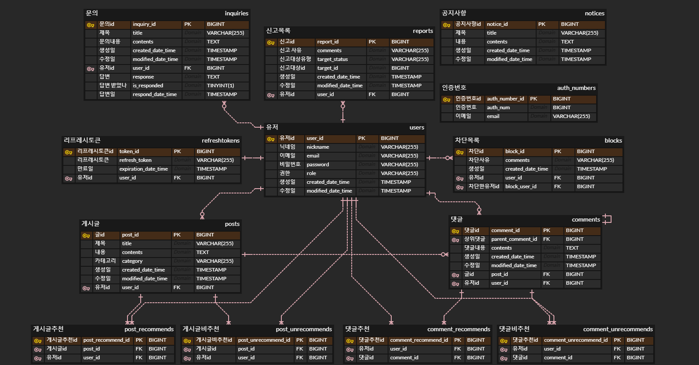

### ERD

---
### TODO

개인 유저에 대한 추천, 비추천, 조회 통계

추천수에 대한 통계도 필요함

통계용 필드 (글하나당 댓글수 등)

유저 정지 기능 추가 필요

쪽지 기능

---
## Trouble

### 특정 글/댓글 신고하는 엔티티는, 어떻게 디자인해야 하나?

방법들
1. 특정 글 신고와 특정 댓글 신고 각각을 독립적인 엔티티로 관리 (FK o)
2. 같은 엔티티로 관리 & 글/댓글 각각의 필드로 관리 (FK o)
3. 같은 엔티티로 관리 & 글/댓글 하나의 필드로 관리 & 구분하는 필드추가 (FK x)

(2번은 무조건 한 필드에서 null 값이 들어갈 수 있으므로 사용 x)

특정 유저가 신고한 글/댓글 리스트를 확인할 때는,  
1번은 두 테이블을 동시에 조회해야 해서 비효율적  
3번은 한 테이블만 조회하면 되므로 효율적

하지만 두 선택지 모두 비즈니스 로직에서 글/댓글을 구분해줘야 한다.

> 1번은 DB와 비즈니스 로직 둘 다 별로지만,  
> (테이블이 늘어나면서, 비즈니스 로직에서도 구분해줘야 함)
> 
> 3번은 비즈니스 로직 입장에서만 별로다.

=> 엔티티를 늘려도, 비즈니스 로직에서 똑같이 구분해줘야 하기 때문에, 엔티티를 늘리지 않는 3번을 골랐다.