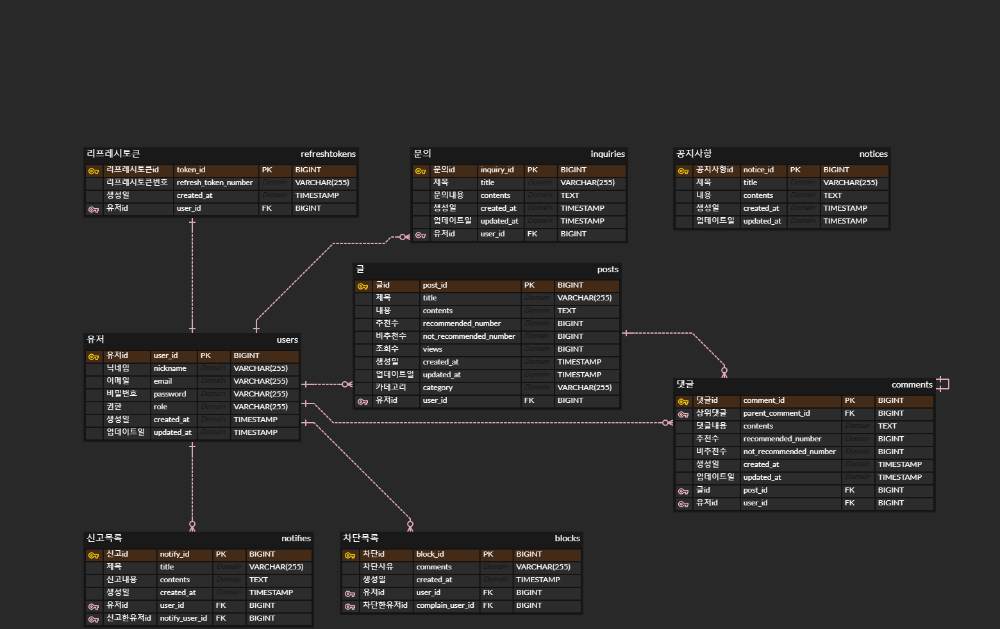

### ERD

`필요한 엔티티`

유저, 글, 댓글, 차단목록, 신고목록, 리프레시토큰, 카테고리, 문의목록

`엔티티에 대한 필드들`

유저 - id, 닉네임, 이메일, 비밀번호, (레벨, 스킬), (관리자인지 아닌지 (나중에))

차단 목록 - id, 유저id(FK), 차단한유저id(FK), 차단사유

리프레시토큰 - id, 유저id(FK), 토큰id

글 - id, 제목, 글내용, 카테고리(FK), 조회수, 추천수, 비추천수, 유저id(FK), 블라인드 여부

카테고리 - id, 카테고리이름

댓글 - id, 댓글내용, 추천수, 비추천수, 글id(FK), 유저id(FK), 댓글id(FK)

문의 - id, 제목, 내용, 문의한유저id(FK)

신고목록 - id, 제목, 내용, 신고한유저id(FK), 신고대상유저id(FK)

(순위를 위한 오늘 조회수, 이번주 조회수, 한달 조회수)

(쪽지 (나중에))

(추천, 비추천, 조회 통계 (나중에))

---

### 고민되는것

댓글과 대댓글은 어떻게 구분할까?
> 자기 자신의 FK

글내용이 너무 많다면 이걸 어떻게 저장하지? 
> DB에 TEXT 타입이 있음

    VARCHAR과 TEXT 타입

    VARCHAR은 최대 255byte를 저장할 수 있는데, 이를 넘어가면 TEXT를 써야함

    TEXT는 65,535 bytes~64kb 저장 가능

글에 이미지 올리면 어디에 저장해야되지?

---

### TODO

댓글 추천 수 일정이상 넘으면 인기댓글 표시를 위한 순위를 매겨야 함

통계용 필드는 나중에(글하나당 댓글수 등)

신고 이유 목록 필요

유저 정지 기능 추가 필요